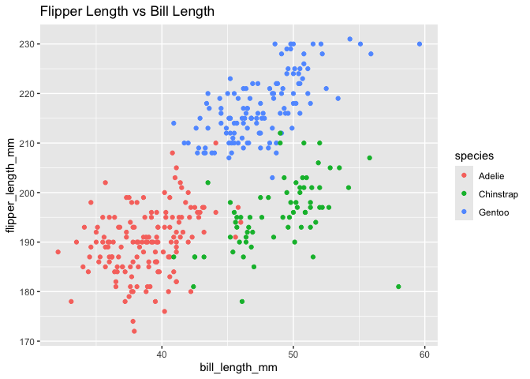

P1805_hw1_ys3924
================
YISU
2024-09-21

``` r
library(tidyverse)
```

## Read in penguins data

Read in penguins dataset

``` r
data("penguins", package = "palmerpenguins")
```

## Write a short description of the penguins dataset

``` r
# Variable names
key_variables <- colnames(penguins)
# Number of rows
num_rows <- nrow(penguins)
# Number of columns
num_columns <- ncol(penguins)
# Mean flipper length
mean_flipper_length <- mean(pull(penguins, flipper_length_mm), na.rm = TRUE)
# Penguins species
penguins_species <- unique(pull(penguins, species))
```

The penguins dataset contains information of different penguins species:
Adelie, Gentoo, Chinstrap, with 344 rows and 8 columns. The key
variables are species, island, bill_length_mm, bill_depth_mm,
flipper_length_mm, body_mass_g, sex, year. The mean flipper length is
200.9152047.

## Create the scatterplot

Use ggplot to create the scatterplot.

``` r
ggplot(penguins, aes(x = bill_length_mm, y = flipper_length_mm, color = species)) +
  geom_point() +
  labs(title = "Flipper Length vs Bill Length")
```

<!-- -->

``` r
# Saving the scatterplot
ggsave("penguins_scatterplot.png")
```

## Create the data frame

Create the data frame by using the tibble function.

``` r
set.seed(1805)
df = tibble(
  vec_sample = rnorm(10, 0, 1),
  vec_logical = vec_sample > 0,
  vec_char = c("this", "is", "ds", "class", "for", "master", "student", "in", "c", "u"),
  vec_factor = factor(sample(c("low", "med", "high"), 10, replace = TRUE))
)
# Print the data frame
df
```

    ## # A tibble: 10 × 4
    ##    vec_sample vec_logical vec_char vec_factor
    ##         <dbl> <lgl>       <chr>    <fct>     
    ##  1     0.0684 TRUE        this     med       
    ##  2    -0.898  FALSE       is       med       
    ##  3    -0.0656 FALSE       ds       low       
    ##  4     1.11   TRUE        class    high      
    ##  5     0.255  TRUE        for      low       
    ##  6     1.39   TRUE        master   low       
    ##  7     0.431  TRUE        student  med       
    ##  8     1.59   TRUE        in       med       
    ##  9     0.677  TRUE        c        low       
    ## 10    -0.584  FALSE       u        high

## Take the mean of a variable in a dataframe

``` r
mean(pull(df, vec_sample))
```

    ## [1] 0.3973729

``` r
mean(pull(df, vec_logical))
```

    ## [1] 0.7

``` r
mean(pull(df, vec_char))
```

    ## [1] NA

``` r
mean(pull(df, vec_factor))
```

    ## [1] NA

When taking the mean of each variable in the dataframe, the numeric and
logical variables work. However, the character vector and factor vector
do not work, because it produces NA values.

## Change the variable type

``` r
mean(pull(df, vec_sample))
mean(as.numeric(pull(df, vec_logical)))
mean(as.numeric(pull(df, vec_char)))
mean(as.numeric(pull(df, vec_factor)))
```

After applying the as.numeric function to the logical and factor
variables, the NA values are no longer present. To be more specific,
logical values results in TRUE becoming 1 and FALSE becoming 0. The
factor variables are converted to integers to represent each level.
However, the mean of character vector produces NA values, because there
is no numerical representation of character variables.
